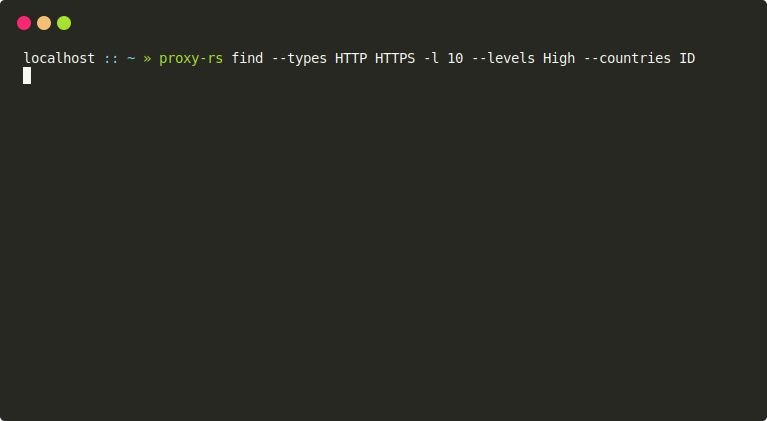

<div align="center">

# Proxy.rs
Proxy.rs is a high-speed proxy tool built with Rust, featuring two main functionalities: scraper and checker.

</div>

## Preview


## Installation

- Install Rust and Cargo.
- Install Git.
- Clone this repository by running the command:
  ```bash
  git clone https://github.com/zevtyardt/proxy.rs.git
  ```
- Navigate to the cloned repository directory:
  ```bash
  cd proxy.rs
  ```
- Run `cargo install --path .` to install.

or install directly using the command

```bash
cargo install --git https://github.com/zevtyardt/proxy.rs
```

## Examples

### find

Find and show 10 HTTP(S) proxies from ID (Indonesia) with the high level of anonymity:
```bash
proxy-rs find --types HTTP HTTPS -l 10 --levels High --countries ID
```


**Options**
- `--types <TYPES>...`: Type(s) (protocols) to check for proxy support. Possible values: HTTP, HTTPS, SOCKS4, SOCKS5.
- `--files <FILES>...`: Path to the file with proxies. If specified, it is used instead of providers.
- `--levels <LEVELS>...`: Level(s) of anonymity (for HTTP only). By default, any level. Possible values: Transparent, Anonymous, High.
- `--support-cookies`: Flag indicating that the proxy must support cookies.
- `--support-referer`: Flag indicating that the proxy must support referer.
- `-c, --countries <COUNTRIES>...`: List of ISO country codes where the proxies should be located.
- `-l, --limit <LIMIT>`: The maximum number of working proxies. Default: 0.
- `-f, --format <FORMAT>`: The format in which the results will be presented. Default: default. Possible values: default, text, json.
- `-o, --outfile <OUTFILE>`: Save found proxies to a file. By default, the output is displayed on the console.

### grab

Find and save to a file 10 ID proxies (without a check):
```bash
proxy-rs grab --countries ID --limit 10 --outfile ./proxies.txt
```


**Options**
- `-c, --countries <COUNTRIES>...`: List of ISO country codes where the proxies should be located.
- `-l, --limit <LIMIT>`: The maximum number of working proxies. Default: 0.
- `-f, --format <FORMAT>`: The format in which the results will be presented. Default: default. Possible values: default, text, json.
- `-o, --outfile <OUTFILE>`: Save found proxies to a file. By default, the output is displayed on the console.

## Currently Under Development

The following features are currently being worked on:

- Implementing proxy DNSBL (Domain Name System Blacklist) checking for enhanced security.
- Improving the speed of the proxy checker for faster validation.
- Added more providers

## Contribution

Contributions to Proxy.rs are welcome! Here's how you can contribute:

- Fork this repository.
- Clone the forked repository to your local machine.
- Create a new branch for your changes.
- Implement your enhancements and commit them.
- Push the branch to your GitHub repository.
- Open a pull request in this repository, describing your changes and why they should be merged.

## License

Proxy.rs is licensed under the MIT License. See the [LICENSE](https://github.com/zevtyardt/proxy.rs/blob/main/LICENSE) file for further details.
